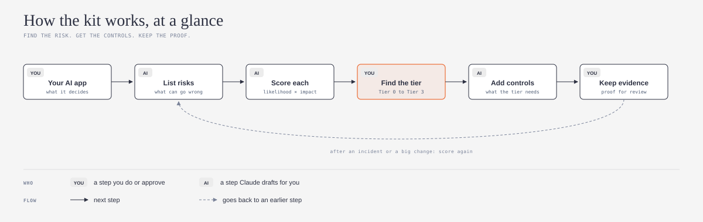
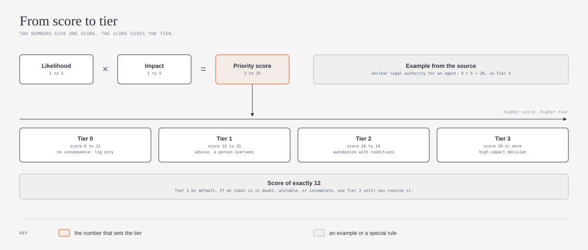
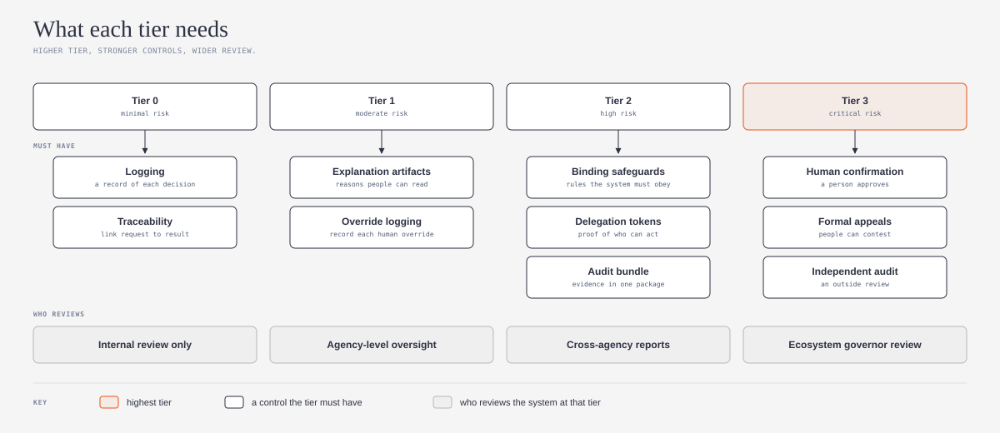

# dpi-ai-governance-explained

## What is it?

This repository has a simple guide and a ready-made skill for your AI agent. The source is [DPI–AI Governance Artifacts](https://github.com/sankarshanmukhopadhyay/dpi-ai-governance-artifacts) by [Sankarshan Mukhopadhyay](https://github.com/sankarshanmukhopadhyay). The source is a large kit for the governance of AI in public digital systems. This guide uses one part of the kit, the risk tier method, and makes it easy to use. The skill is a `SKILL.md` file in the open [Agent Skills](https://agentskills.io) format, so it works with many AI agents.



*For simple meanings of the technical words, refer to the [Jargon Buster](JARGON.md).*

## What problem does it solve?

Different AI apps have different levels of risk, so they need different controls. If you do not know the level of risk of your app, you can add too few controls or too many. This kit tells you how much risk your app or agent has. It also tells you which controls it must have at that level of risk.

## Who is it for?

This kit is for small teams, teams that grow quickly, and solo builders who put AI agents into real work. You do not need to be a specialist in risk, cybersecurity, governance, or safety. Before people use it, you must know which problems can occur. You do not need knowledge of law, audit, or governance.

The source kit is for public services, for example government agencies. The method also works for a small team. The source gives a pathway for a startup or a small team in `docs/guides/adoption-pathways.md`.

## Safe by default

1. **The agent reads and drafts first.** Your AI agent does not change your code or your files until you approve.
2. **You decide the tier.** The agent proposes the scores and the tier. You confirm them or you change them.
3. **The agent uses the careful rule.** If a score of 12 has an input that is not sure, the agent uses the higher tier.
4. **No legal approval.** The kit gives you a structure. The kit does not make your app legal, certified, or approved.

## What does it do?

When you ask your AI agent for help with the risk of your app, the skill tells the agent to do these steps with you:

1. Find out what your app decides, and which persons the decisions affect.
2. Make a list of the risks for your app.
3. Give each risk a likelihood score and an impact score, from 1 to 5.
4. Multiply the two numbers to get the priority score of each risk.
5. Find the risk tier from the priority score.
6. List the controls that the tier must have.
7. List the evidence that shows that each control works.

The skill also tells the agent about frequent errors. For example, a team adds all of the controls without a reason, or a team keeps documents that no person reads.

## How does it work?

*The diagrams below use the visual language of [cathrynlavery/diagram-design](https://github.com/cathrynlavery/diagram-design):*



Each risk gets two numbers from 1 to 5. Likelihood tells how frequently the problem can occur. Impact tells how bad the result is for people. The product of the two numbers is the priority score. A score of 0 to 11 is Tier 0, and a score of 20 or more is Tier 3.

The source gives an example. An agent that acts without a clear legal authority gets 4 × 5 = 20. That is Tier 3.



Each tier has a set of controls. Tier 0 must have only logs and traceability. Tier 3 must have a person who confirms decisions, a formal appeal for affected people, and an independent audit. A higher tier also sends the review to a wider group.

The source does not tell you that a higher tier includes the controls of the lower tiers. This guide does not add that rule.

## How to install

Each AI agent keeps skills in a different folder. Put the full skill folder there, and name the folder `dpi-ai-risk-tiers`. Claude, Codex, and GitHub Copilot are the most used AI agents for code in the [JetBrains 2026 survey](https://blog.jetbrains.com/research/2026/08/ai-coding-agent-adoption-2026/). Other agents that support Agent Skills work in the same way.

### One command for all agents

If you have Node.js, run this command in a terminal. The command installs the skill for Claude Code, Codex, GitHub Copilot, and other agents.

```
npx skills add ams-builds/dpi-ai-governance-explained
```

To get the latest version later, run `npx skills update`. The command uses [skills](https://github.com/vercel-labs/skills) by [Vercel](https://github.com/vercel-labs). If you do not use a terminal, use the instructions for your agent below.

### Claude

1. For claude.ai or the Claude desktop app, make a zip file of the skill folder.
2. Upload the zip file in **Settings > Capabilities > Skills**.
3. For Claude Code, put the folder in `~/.claude/skills/dpi-ai-risk-tiers/`.

### Codex

1. Put the folder in `~/.agents/skills/dpi-ai-risk-tiers/` for all of your projects.
2. Or put the folder in `.agents/skills/dpi-ai-risk-tiers/` in one project.
3. Or tell Codex to use `$skill-installer` with the GitHub URL of this repository.
4. If the skill does not show, start Codex again. Refer to the [Codex skills documentation](https://learn.chatgpt.com/docs/build-skills).

### GitHub Copilot

1. Put the folder in `~/.copilot/skills/dpi-ai-risk-tiers/` for all of your projects.
2. Or put the folder in `.github/skills/dpi-ai-risk-tiers/` in one repository.
3. Use Copilot in agent mode. Refer to the [Copilot skills documentation](https://docs.github.com/en/copilot/how-tos/copilot-cli/customize-copilot/create-skills).

## How to use it

After you install the skill, speak to your AI agent as usual:

- "Find the risk tier of my AI app."
- "Which controls must my agent have?"
- "Score the risks of this new feature."

The skill starts automatically. You do not need to use its name.

## Credit and license

This guide is based on **DPI–AI Governance Artifacts**, version 1.2.0 (released 2026-10-01), by [Sankarshan Mukhopadhyay](https://github.com/sankarshanmukhopadhyay): <https://github.com/sankarshanmukhopadhyay/dpi-ai-governance-artifacts>.

This is an independent guide. It is not an official part of the source project, and the source author did not review it.

What I changed:

1. I explained the risk tier method in simple words in Simplified Technical English.
2. I made three new diagrams.
3. I wrote an agent skill (`SKILL.md`) that applies the method to an app or an agent.
4. I used only a small part of the source. Most of the source kit is not in this repository.

The source uses the Creative Commons Attribution-ShareAlike 4.0 International license (CC BY-SA 4.0). This repository uses the same license, as the ShareAlike term tells. Refer to [LICENSE](LICENSE) and [NOTICE.md](NOTICE.md).

**Language.** I wrote the text in Simplified Technical English (ASD-STE100). The idea to ask an AI model to write in ASD-STE100 comes from [Andrej Karpathy](https://github.com/karpathy) ([his post on X](https://x.com/karpathy/status/2105819303471976479)). I used the [simplified-technical-english](https://github.com/0xpili/simplified-technical-english) agent skill by [pili](https://github.com/0xpili) to write and check the text. ASD-STE100 is a specification of ASD (AeroSpace and Defence Industries Association of Europe). This repository is not related to ASD.

---

*For simple meanings of new words, refer to the [Jargon Buster](JARGON.md). It has risk tier, priority score, decision receipt, evidence bundle, and more.*
